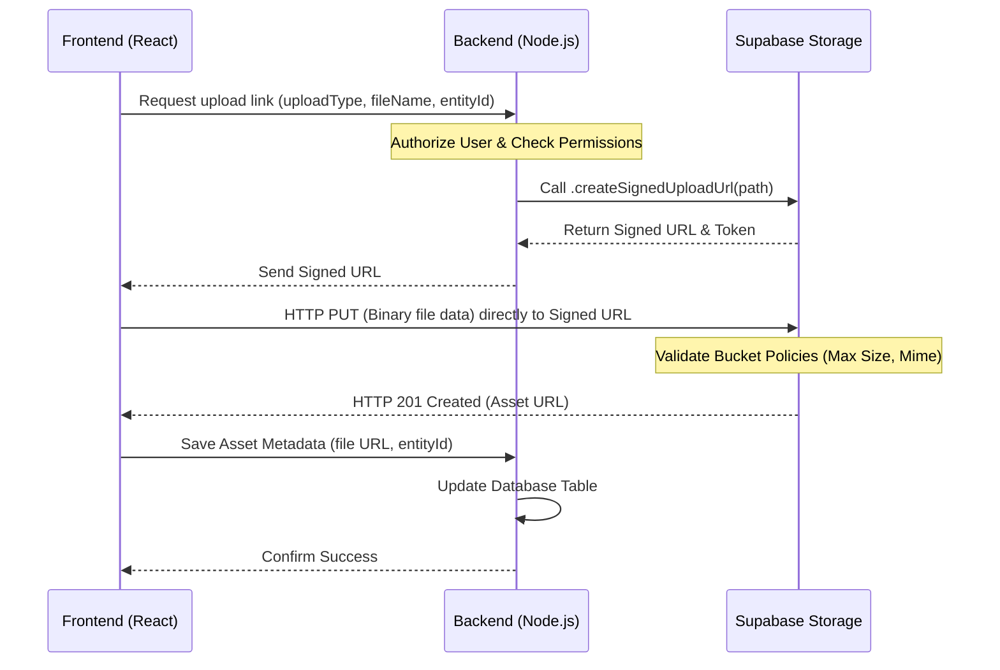

# Blueprint: Direct Client-to-Cloud Uploads via Supabase Signed URLs

This document serves as a note and technical guide for implementing direct client-to-cloud uploads using **Supabase Signed Upload URLs**. This architecture completely bypasses the Node.js backend server during the file transfer phase, saving server CPU, RAM, and bandwidth.

---

## 1. Architecture Overview



---

## 2. Backend Implementation (Node.js)

To generate a signed upload URL, we will use the Supabase Storage SDK.

### Route definition:

```javascript
// routes/upload.routes.js
router.post(
  "/request-upload-url",
  verifyJWT,
  uploadControllers.requestUploadUrl
);
```

### Controller/Service method:

```javascript
import { supabase } from "../../config/supabase.js";
import { ApiError } from "../../utils/ApiError.js";

const getSignedUploadUrl = async (userId, uploadType, entityId, fileName) => {
  // 1. Validate & Authorize (Same configs as fileUpload.service.js)
  // E.g. check if user has admin role in target entityId

  const fileExtension = fileName.split(".").pop();
  const uniqueName = `${Date.now()}-${Math.round(Math.random() * 1e9)}.${fileExtension}`;
  const filePath = `${entityId}/${uploadType}/${uniqueName}`;
  const bucketName = "video_assets"; // or dynamic based on uploadType

  // 2. Generate Signed Upload URL (expires in 60 seconds)
  const { data, error } = await supabase.storage
    .from(bucketName)
    .createSignedUploadUrl(filePath, { expiresIn: 60 });

  if (error || !data) {
    throw new ApiError(500, error?.message || "Failed to generate upload URL");
  }

  // data contains: { signedUrl, token, path }
  return {
    uploadUrl: data.signedUrl,
    publicUrl: `${process.env.SUPABASE_URL}/storage/v1/object/public/${bucketName}/${filePath}`,
    filePath,
  };
};
```

---

## 3. Frontend Implementation (React)

Instead of sending `FormData` to our backend, the frontend will perform a 2-step process.

### Step 1: Request the URL & Step 2: Upload File

```typescript
import api from "@/config/axios";

export const uploadLargeFileDirectly = async (
  file: File,
  uploadType: string,
  entityId: string
) => {
  // 1. Get signed URL from backend
  const urlResponse = await api.post("/uploads/request-upload-url", {
    uploadType,
    entityId,
    fileName: file.name,
  });

  const { uploadUrl, publicUrl } = urlResponse.data.data;

  // 2. PUT file directly to Supabase storage URL
  const uploadResult = await fetch(uploadUrl, {
    method: "PUT",
    headers: {
      "Content-Type": file.type,
    },
    body: file, // Binary data stream
  });

  if (!uploadResult.ok) {
    throw new Error("Failed to upload file to storage bucket");
  }

  // 3. Inform backend to save asset metadata in database
  const saveResponse = await api.patch("/uploads/confirm-upload", {
    uploadType,
    entityId,
    fileUrl: publicUrl,
  });

  return saveResponse.data;
};
```

---

## 4. Key Considerations & Tradeoffs

1. **Orphaned Files**: If the user uploads the file to Supabase (Step 2) but closes the tab before the metadata is saved (Step 3), the file remains in storage but is not registered in the database.
   - _Fix_: Implement a database trigger or periodic cron job to delete files in Supabase that do not have database references.
2. **Access Security**: Ensure the path inside the Supabase Storage Bucket matches the Signed URL token to prevent users from uploading files to other users' directories.
3. **No Image Compression on Node Server**: Since the file bypasses our server, we cannot compress it using libraries like `sharp` on Node.js. Compression must be handled on the client side (using browser canvas compression before uploading) or using a serverless database trigger in Supabase (Edge Functions).
